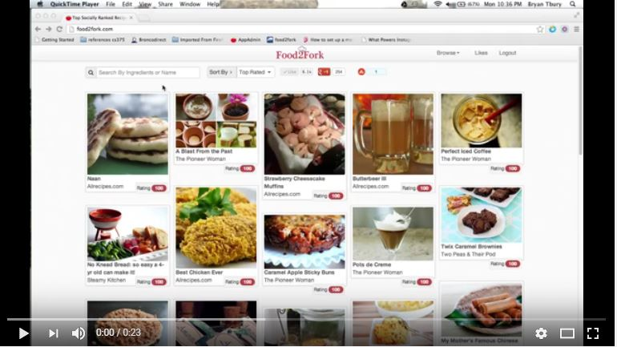

# Data-Representation-and-Querying-Project 2016
## Conor Tighe - Meal Manager Web App - G00314417
This repository contains a single web application called Meal Manager that I will be submitting as my project for Data Representation and Querying, a third year software development module in GMIT in the Department of Computer Science and Applied Physics. The Flask python framwork is required to serve the applcation to the browser.

## Project Overview:
The aim of my project is to create a hub where a user can find a recipe, view the ingrediants and save the recipe locally. The web application uses an online API to search a wide selection of meal blogs and review sites, It then uses a local database to store the recipes for the user. I used a HTML, CSS, and JS Framework called [Bootstrap](http://getbootstrap.com/) to make the UI fast to develope and the data easy to display aesthetically on the front end. I decided to use [Sqlite](https://sqlite.org/) to create the database as apposed to  couchDB or MongoDB as I feel sqlite was more suitable for this app and the purpose of the apps storage. I used a API found on [Mashape](https://www.mashape.com/), this is a site which hosts APIs for companys like [Amazon](https://www.amazon.co.uk/), [Spotify](https://www.spotify.com/ie/), [ESPN](http://www.espn.com/) and more which was one of the main reasons I used them as I wanted to ensure the API would be reliable and secure for my project. To interact with the API I used the AJAX calls in the [jQuery](https://jquery.com/) library to GET recipes from Mashape using a Mashape key, and to later POST those recipe details to mysqlite. A ingredients list is set up as soon as the app is opened with a bootstrap table header, the data is later injected into the table depending on what recipe is clicked on and can be deleted individually.

### The API I will be using is called Food2Fork:
 

